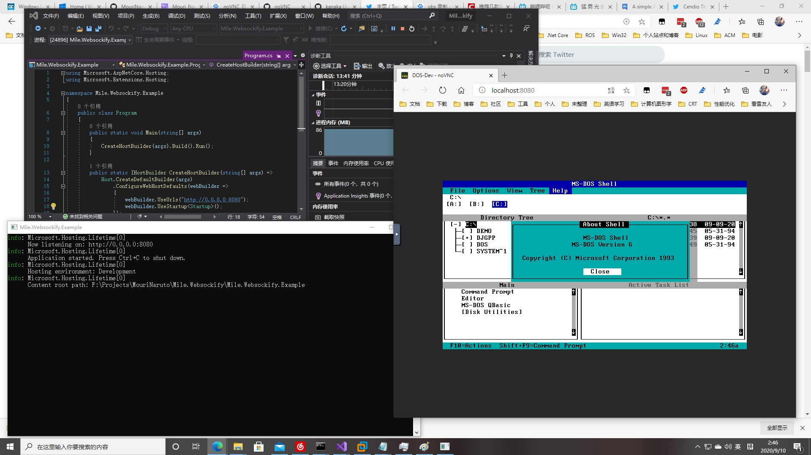

# Mile.Websockify

A simple ASP.NET Core Middleware implementation of the Websockify. It used to 
be one small component of my graduation project in several months ago. But I
have split it to an independent project in the recent days.

If I can contribute this repo to the noVNC organization directly. I will be 
very happy because I can help more people than before.

I have tested my implementation with the VMware Workstation's built-in VNC 
server. Here is the screen capture image.



## Origin

My graduation project is making a V2X framework with web-based dashboard for 
autonomous driving. I choose ASP.NET Core for implementing the V2X framework 
because I don't want to face the ABI issues under the Linux and make it 
cross-platform. I think the framework should add the remote desktop support
for reducing the work for debugging the autonomous driving algorithms. So I 
choose the noVNC but I don't want to use the original WebSockify implementation
because I want to reduce the exported tcp ports.

The implementations in the websockify, websockify-js and websockify-other 
repositories are too messy, so I can't refer it and make me disappointed. But I
think I should try to translate the WebSocket to the TCP socket directly and I 
felt surprised because it works properly, lol.

## Usage

In the Configure method of the Startup class of the ASP.NET Core project. You 
can use app.UseWebsockify method to enable the Websockify support for your 
ASP.NET Core projects. Here is the example:

```
app.UseWebsockify("/websockify", "127.0.0.1", 5900);
```

For more information, please refer to the Mile.Websockify.Example project.

## License

The repository (except the noVNC instance in the example project) is distributed 
under the MIT License.

## Kenji Mouri
